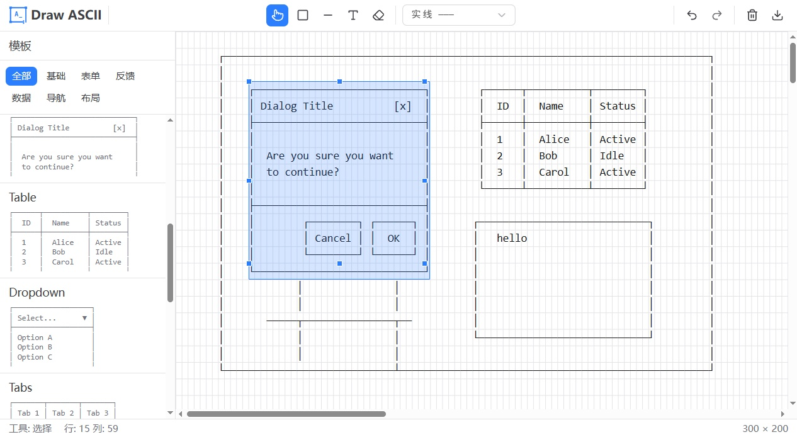
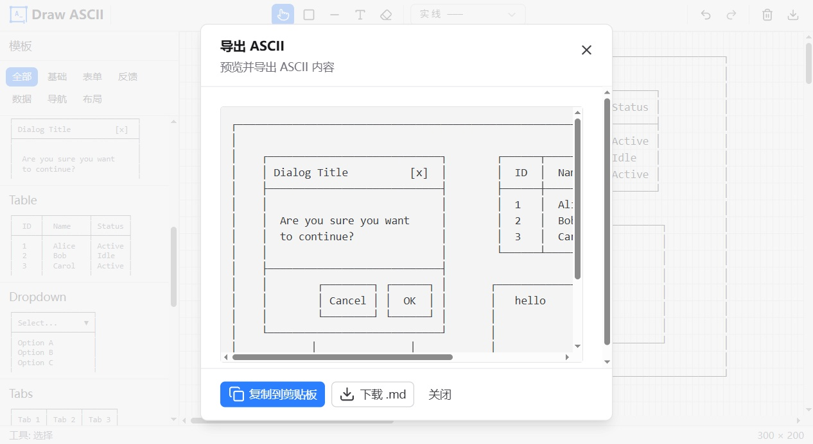

# Draw ASCII

**轻量级 ASCII 线框图编辑器 —— 让 AI 读懂你的草图，让文档回归纯文本。**

**立即使用：[draw-ascii.vercel.app](https://draw-ascii.vercel.app/)**

|            绘制             |            导出             |
| :-------------------------: | :-------------------------: |
|  |  |

---

### 为什么选择 Draw ASCII？

在与 AI 交流或编写技术文档时，你是否遇到过以下烦恼？

* **配置成本过高**：不想配置复杂的 Figma MCP 或其他第三方插件，只想快速表达一个结构。
* **非多模态限制**：模型无法识别图片，沟通效率低下。
* **上下文焦虑**：高清图片占用大量 Token，甚至导致长对话中断。
* **版本管理难**：图片难以在 Git 中追踪差异，修改繁琐。

**Draw ASCII** 将复杂的视觉构思转化为纯文本字符流。无论是架构草图还是流程图，都能以最精简、最语义化的方式呈现给 AI 和开发者。

---

### 功能特性

* **精细绘图**：支持矩形框、直线及带箭头的连接线。
* **直观操作**：支持选取、拖拽移动、复制及批量删除，体验类传统绘图软件。
* **灵活调整**：框体支持实时拉伸（Resize），自动适配内容。
* **文本集成**：支持在任意位置插入文本说明。
* **容错处理**：完善的撤销（Undo）与重做（Redo）机制。
* **一键导出**：快速复制纯文本，直接粘贴至 Markdown 或 AI 对话框。
* **高效模板**：内置常用预定义模板，一秒起步。

---

### 快速开始

#### 开发环境

```bash
# 安装依赖
pnpm install

# 启动开发服务器
pnpm dev

```

#### 构建发布

```bash
# 生成生产环境构建
pnpm build

```

---

### 开源协议

本项目基于 [MIT](LICENSE) 协议开源。
